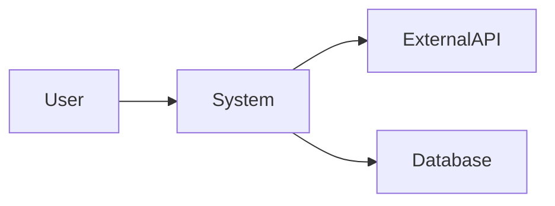
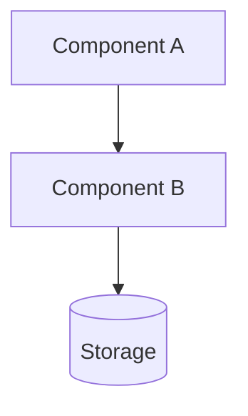
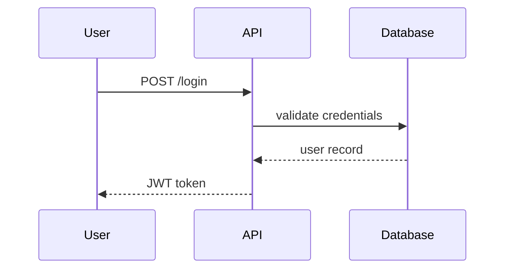

# Architecture Overview: [Covered Product, Module, Component, Service, or Coherent Area]

## Metadata

**Last Updated:** [YYYYMMDD]
**Owner:** [Name]
**Physical Scope:** Repository/Product | Module | Component | Service
**Covered Area (optional):** [A coherent subsystem within that physical scope, such as "auth flow", "pricing engine", or "event pipeline"; otherwise "Not applicable"]

## Purpose

[1-2 paragraphs. What this system does and who uses it. Written for someone who has never seen the code — assume zero context. Describes existing behavior, not future plans.]

## Context

[Where this fits in the larger picture. External actors (users, partner services), upstream and downstream dependencies, the system boundary.]

## Architecture

[High-level component view. What the major pieces are and how they fit together. One or two paragraphs of narrative around the diagram.]

### Components

| Component | Responsibility | Key technologies |
|-----------|----------------|------------------|
| [Name] | [What it does] | [tech stack] |
| [Name] | [What it does] | [tech stack] |

## Runtime Behavior

[How requests flow through the system at runtime. One sequence diagram per primary use case. Edge cases defer to per-component runbooks or design docs.]

### [Use Case 1: e.g., User Login]

### [Use Case 2]

## Data Model

[High-level entity view. What lives in the system, key relationships. Defers to Data Dictionary for field-level detail.]

- **Primary entities:** [Entity 1, Entity 2]
- **Storage:** [database, schema reference]
- **See:** [Data Dictionary](relative-link-to-data-dictionary) for field-level definitions <!-- link-check-ignore: resolve from solution-structure -->

## Cross-Cutting Concerns

### Security

[Authn/authz approach, secrets management, attack surface notes]

### Observability

[Logging, metrics, tracing approach. Dashboards.]

### Scalability & Performance

[Throughput targets, scaling model, known bottlenecks]

### Reliability

[SLOs, failure modes, recovery patterns]

## Design Decisions

[Index of key architectural choices that shaped this system. Each item links to its ADR for the *why* — this section catalogs, doesn't re-explain.]

- [Decision area] — see [ADR-yyyyMMddHHmm-slug](relative-link-to-adr) <!-- link-check-ignore: resolve from solution-structure -->
- [Decision area] — see [ADR-yyyyMMddHHmm-slug](relative-link-to-adr) <!-- link-check-ignore: resolve from solution-structure -->

## Operational Characteristics

- **Deployment:** [CI/CD pipeline, rollout strategy]
- **Environments:** [Dev / Staging / Prod URLs and access]
- **Owner team:** [Team that runs it]
- **On-call:** [Rotation, escalation]

## Known Limitations

[What this system intentionally doesn't do, plus tech debt the next reader should know about. Be specific — vague limitations are useless.]

- [Limitation or debt item]
- [Limitation or debt item]

## References

- [Tech Stack Overview](relative-link-to-tech-stack-overview) <!-- link-check-ignore: resolve from solution-structure -->
- [Data Dictionary](relative-link-to-data-dictionary) <!-- link-check-ignore: resolve from solution-structure -->
- [Business Glossary](relative-link-to-business-glossary) <!-- link-check-ignore: resolve from solution-structure -->
- [Related ADRs / RFCs / Design Docs]

## Revision History

| Date | Author | Changes |
|------|--------|---------|
| [YYYYMMDD] | [Name] | Initial version |
